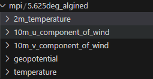
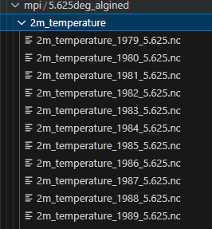
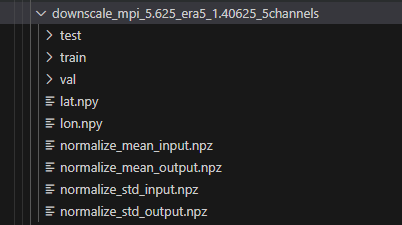
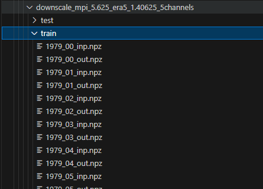

# 代码说明

## 主要步骤

### 1.数据预处理

使用climax_downscaling中对数据的预处理，在`/climax_preproces/src/data_preprocessing`，将nc文件转为npy文件：(注意看里面的输入和输出路径)


1. 对齐数据
```
python align_era5_to_mpi.py
```
该代码的功能是把era5数据和mpi-esm数据进行对齐（因为其时间分辨率不一致），然后保存为下面对应的目录格式：



2. nc转为npz
```
python nc2np_downscaling_mpi_to_era5.py
```
该代码的功能是把era5数据和mpi-esm数据统一转换为npz，并保存为下面对应的目录格式：(**注意：** 这里的代码中还做了个resize的操作因为，mpi-esm不少5.625°的，实际使用时请根据需要改一下代码)





**重要的总结！！！！！！：** 对于输入的数据，我们需要把数据转换为npz格式，然后再进行训练和测试。而npz的构成如下：含有若干个变量名为key, 如'2m_temperature', 每个key对应的value是一个数组，数组的shape为：(time, 1, height, width)，其中time为时间维度，1即是变量个数（一直为1），height为高度维度，width为宽度维度。


### 2.环境配置

​	安装pytorch1.13.1，推荐使用pip安装：

```
# CUDA 11.6
pip install torch==1.13.1+cu116 torchvision==0.14.1+cu116 torchaudio==0.13.1 --extra-index-url https://download.pytorch.org/whl/cu116
# CUDA 11.7
pip install torch==1.13.1+cu117 torchvision==0.14.1+cu117 torchaudio==0.13.1 --extra-index-url https://download.pytorch.org/whl/cu117
```

其他的环境都是用pip可以安装的，尝试运行训练代码，然后对里面不满足的环境进行pip指令安装即可。（如xarray,tqdm,yaml之类的）。另外关于MoE环境的配置参考https://github.com/laekov/fastmoe.git安装。


### 2.训练和测试

（1）使用分布式训练：

```
python -m torch.distributed.launch --nproc_per_node=4 train-ddp.py --config configs/train-weather/5channels/compare/train_mpi5.625_era51.40625_5channels_rdn-minet.yaml --gpu '0,1,2,3'
```

训练的结果日志和模型参数会保存在`./save`文件夹下，对应配置的名称。如`./save/train_rdn-minet/`文件夹下，其他关于训练的配置和模型都可以在配置文件中进行修改。

（2）测试：

```
python test.py --config configs/test/compare/train_mpi5.625_era51.40625_5channels.yaml --model save/_train_mpi5.625_era51.40625_5channels_rdn-minet/epoch-best.pth --gpu '0' --save_res
```

`--save_res` 会保存测试的结果作为nc文件